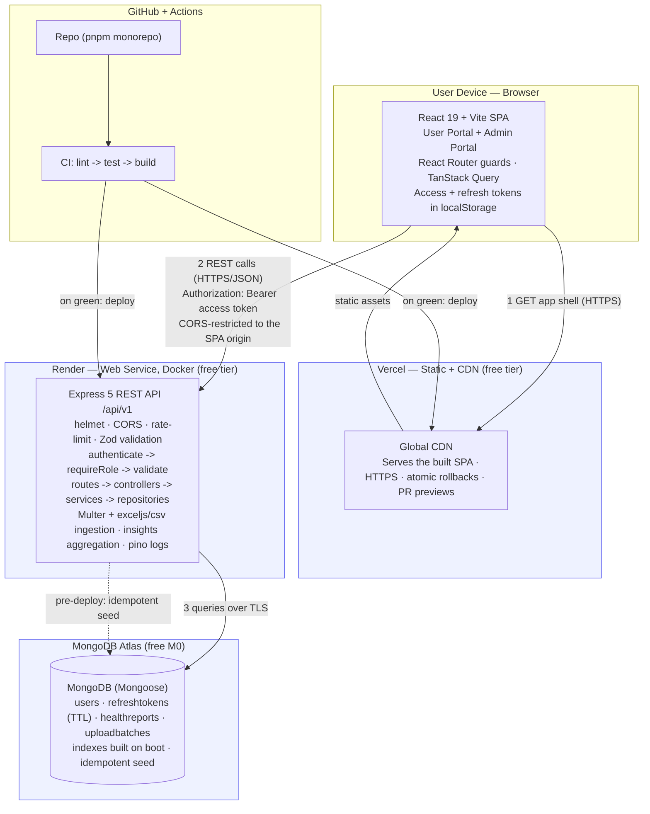

# Architecture

A three-tier application: a React single-page app, a separate Express REST API,
and MongoDB. The frontend and backend are deployed independently and only ever
talk over HTTPS/JSON, which keeps the boundary between them honest.

> These diagrams render directly on GitHub. To export an image, paste any block
> into the [Mermaid Live Editor](https://mermaid.live) and download a PNG/SVG.

## System & deployment topology



## Authentication flow

Stateless access tokens (15 min) authorize every request; long-lived refresh
tokens (7 days) are **rotated** on use and stored server-side only as hashes, so
they can be revoked and reuse can be detected.

```mermaid
sequenceDiagram
  participant SPA as React SPA
  participant API as Express API
  participant DB as MongoDB

  SPA->>API: POST /auth/login { email, password }
  API->>DB: find user, verify (bcrypt hash)
  API->>DB: store SHA-256 hash of new refresh token
  API-->>SPA: 200 { user, accessToken, refreshToken }
  Note over SPA: tokens kept in localStorage

  SPA->>API: GET /me/reports/latest (Bearer access)
  API->>API: verify JWT -> req.user
  API-->>SPA: 200 { data }

  Note over SPA,API: access token expires -> 401
  SPA->>API: POST /auth/refresh { refreshToken }
  API->>DB: match hash; rotate (mark old replacedBy)
  API-->>SPA: 200 { new access + refresh }

  Note over API,DB: reuse of an old token = theft signal
  SPA->>API: POST /auth/refresh { old refreshToken }
  API->>DB: revoke entire token family
  API-->>SPA: 401 — sign in again
```

## Data ingestion flow

An upload is either the clinic's `.xlsx` (a `clients` sheet + a `health_reports`
sheet, linked by `client_id`) or a health-report CSV. The pipeline favours partial
success — one bad row never sinks the whole file — and every import is auditable.

```mermaid
sequenceDiagram
  participant Admin as Admin (SPA)
  participant API as Express API
  participant DB as MongoDB

  Admin->>API: POST /admin/reports/upload (multipart xlsx/CSV)
  API->>DB: create UploadBatch (status PROCESSING)
  API->>API: parse workbook (exceljs) or CSV -> normalized rows

  Note over API,DB: phase 1 — clients (xlsx only)
  API->>API: validate client rows with Zod
  API->>DB: bulkWrite upsert by client_id (created vs updated)

  Note over API,DB: phase 2 — reports
  API->>API: validate report rows; resolve client_id/email -> userId
  API->>API: dedupe by report_id within the file; build report docs
  API->>DB: find existing (userId, dedupeKey) — skip those
  API->>DB: insertMany(ordered:false) in chunks
  API->>DB: finalize batch (COMPLETED | PARTIAL | FAILED) + per-sheet errors
  API-->>Admin: 201 { clientsCreated, clientsUpdated, inserted, skipped, failed, errors[] }
  Note over Admin: re-uploading the same file -> clients updated, reports all skipped
```

Population analytics for the Insights dashboard (`GET /admin/insights`) are
computed with MongoDB aggregation — demographic group-bys over `users`, and a
single `$facet` pass over each client's latest report for the abnormal-rate
breakdowns.

## Why these shapes

- **Separate SPA + API.** The brief mandated a standalone Express backend, and a
  hard frontend/backend split makes the contract explicit and each tier
  independently deployable and scalable.
- **Header-based JWTs with server-side refresh records.** Simple cross-origin
  deployment (no cookie/CSRF dance) while still supporting revocation and
  reuse-detection — the security property that actually matters.
- **Embedded metrics + a `(userId, dedupeKey)` unique index.** Each report is a
  single self-contained document; the unique index makes re-imports idempotent
  without multi-document transactions (which a standalone MongoDB can't do).
- **`(userId, reportDate)` compound index.** Serves both "latest report" and
  paginated history with no in-memory sort — the system's hottest path.
